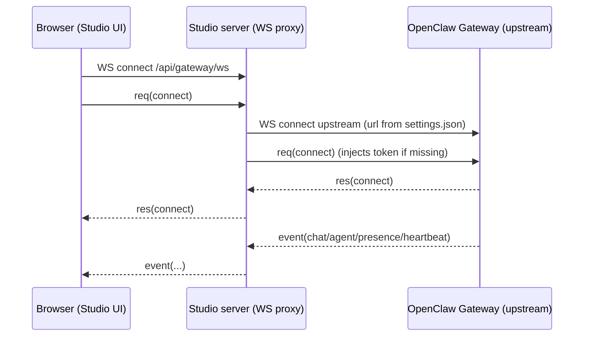

# PI + Chat Streaming (Studio Side)

This document exists to onboard coding agents quickly when debugging chat issues in OpenClaw Studio.

Scope:
- Describes how Studio connects to the OpenClaw Gateway, how runtime streaming arrives over WebSockets, and how the UI renders it.
- Treats **PI** as “the coding agent running behind the Gateway” (an OpenClaw agent). Studio does not implement PI logic; it displays and controls the Gateway session.

Non-scope:
- PI internals and model/tool execution details. Those live in the OpenClaw repository and the Gateway implementation.

## Relationship To OpenClaw (What’s Vendored Here)

Studio vendors the browser Gateway client used to speak the Gateway protocol:
- Vendored client: `src/lib/gateway/openclaw/GatewayBrowserClient.ts`
- Sync script (from an OpenClaw checkout): `scripts/sync-openclaw-gateway-client.ts`

If a protocol mismatch is suspected (missing event fields, renamed streams, different error codes), start by checking whether Studio’s vendored client is in sync with the Gateway version you’re running.

## Terminology

- Studio: this repo, a Next.js UI with a custom Node server.
- Gateway (upstream): the OpenClaw Gateway WebSocket server (default `ws://localhost:18789`).
- WS bridge / proxy: Studio’s server-side WebSocket that bridges the browser to the upstream Gateway.
- Frame: JSON message over WebSocket (request/response/event).
- Run: a single streamed execution identified by `runId`.
- Session: identified by `sessionKey` (Studio uses `agent:<agentId>:<mainKey>` for main sessions).

## High-Level Network Path

There are two separate WebSocket hops:



Files:
- WS proxy entrypoint: `server/index.js`
- WS proxy implementation: `server/gateway-proxy.js`

## Studio Settings (Where Gateway URL/Token Come From)

Studio stores Gateway connection settings on the Studio host (not in the browser):
- `~/.openclaw/openclaw-studio/settings.json` (see `README.md` for the canonical location)

The WS proxy loads these settings server-side and opens the upstream connection.

Files:
- Settings file access (server): `server/studio-settings.js`
- Settings API route (browser -> server): `src/app/api/studio/route.ts`
- Client-side load/patch coordinator: `src/lib/studio/coordinator.ts`

## WebSocket Frame Shapes

Studio expects Gateway frames shaped like:

```json
{ "type": "req", "id": "uuid", "method": "connect", "params": { } }
{ "type": "res", "id": "uuid", "ok": true, "payload": { } }
{ "type": "res", "id": "uuid", "ok": false, "error": { "code": "…", "message": "…" } }
{ "type": "event", "event": "chat", "payload": { } }
```

Types live in:
- `src/lib/gateway/GatewayClient.ts`

### Connect handshake

The first frame from the browser must be `req(connect)`. The WS proxy:
- Rejects non-`connect` frames until connected.
- Opens an upstream WS to the configured Gateway URL.
- Injects `auth.token` into the connect params if the connect frame does not already contain a token, and if it does not include a device signature.

Code:
- Connect enforcement + token injection: `server/gateway-proxy.js`

### Connect failures

On failure to load settings or open upstream, the proxy sends an error `res` for the connect request (when possible) and then closes the WS.

Error codes used by the proxy include:
- `studio.gateway_url_missing`
- `studio.gateway_token_missing`
- `studio.gateway_url_invalid`
- `studio.settings_load_failed`
- `studio.upstream_error`
- `studio.upstream_closed`

## Streaming: What the Gateway Sends and How Studio Uses It

Studio classifies gateway events by `event` name:
- `presence`, `heartbeat`: summary refresh triggers
- `chat`: runtime chat messages (delta/final)
- `agent`: runtime per-stream deltas (assistant/thinking/tool/lifecycle)

Code:
- Classification: `src/features/agents/state/runtimeEventBridge.ts`
- Execution: `src/features/agents/state/gatewayRuntimeEventHandler.ts`

### `event: "chat"` payload

Studio treats `chat` events as the canonical “message” stream for transcript completion. Expected fields:
- `runId`
- `sessionKey`
- `state`: `delta | final | aborted | error`
- `message` (shape varies; Studio extracts text/thinking/tool metadata defensively)

Key behaviors (Studio-side):
- Ignores user/system roles for transcript append (but uses them for status/summary).
- On `final`, appends:
  - a `[[meta]]{...}` line (timestamp and thinking duration when available)
  - a `[[trace]]` thinking block when extracted
  - tool call/result markdown lines when present
  - the assistant text (if any)
- If a `final` assistant message arrives without an extractable thinking trace, Studio may request `chat.history` as recovery.

### `event: "agent"` payload

Studio uses `agent` events for live streaming and richer tool/lifecycle updates. Expected fields:
- `runId`
- `stream`: `assistant | tool | lifecycle | <reasoning stream>`
- `data`: record with `text`/`delta` and stream-specific keys

Stream handling (high-level):
- `assistant`: merges `data.delta` into a live `streamText` for the UI.
- reasoning stream (anything that is not `assistant`, `tool`, `lifecycle` and matches hints like `reason`/`think`/`analysis`/`trace`): merged into `thinkingTrace`.
- `tool`: formats tool call and tool result lines using `[[tool]]` and `[[tool-result]]`.
- `lifecycle`: start/end/error transitions; if a run ends without chat events, Studio may “flush” the last streamed assistant text as a final transcript entry.

Code:
- Runtime agent stream merge + append: `src/features/agents/state/gatewayRuntimeEventHandler.ts`

## How Chat UI Renders Streaming

Studio keeps an `outputLines: string[]` transcript per agent, plus live fields like `streamText` and `thinkingTrace`.

Rendering pipeline:
- `outputLines` contains:
  - user messages as `> ...`
  - assistant messages as raw markdown text
  - tool call/results with prefixes `[[tool]]` and `[[tool-result]]`
  - optional meta lines `[[meta]]{...}` for timestamps and thinking durations
  - optional thinking trace lines `[[trace]] ...`
- The panel derives structured chat items from `outputLines` and (optionally) live streaming state.

Files:
- Chat panel UI: `src/features/agents/components/AgentChatPanel.tsx`
- Transcript parsing into items: `src/features/agents/components/chatItems.ts`
- Message extraction helpers (text/thinking/tool parsing): `src/lib/text/message-extract.ts`

## History Sync (Recovery, Load More)

Studio can fetch history via `chat.history` and merge it into the transcript.

Key points:
- Studio intentionally treats gateway history as canonical for timestamps/final ordering.
- History merge is designed to avoid duplicates and reconcile local optimistic sends.
- Transcript v2 can be toggled with `NEXT_PUBLIC_STUDIO_TRANSCRIPT_V2`.
- Transcript debug logs can be enabled with `NEXT_PUBLIC_STUDIO_TRANSCRIPT_DEBUG`.

Files:
- History operation: `src/features/agents/operations/historySyncOperation.ts`
- Transcript merge/sort primitives: `src/features/agents/state/transcript.ts`

## Debugging Checklist (When Chat “Feels Buggy”)

Start with the hop where symptoms appear.

WS bridge / connectivity:
- Studio server logs (proxy): `server/gateway-proxy.js`
- Common failures: wrong `ws://` vs `wss://`, missing token, gateway closed, upstream TLS mismatch

Streaming correctness (missing/duplicated output):
- Event classification + runtime stream merge: `src/features/agents/state/gatewayRuntimeEventHandler.ts`
- Text/thinking/tool extraction quirks: `src/lib/text/message-extract.ts`
- UI item derivation and collapsing rules: `src/features/agents/components/chatItems.ts`

History and ordering issues:
- `chat.history` merge logic and dedupe: `src/features/agents/operations/historySyncOperation.ts`
- Transcript entry ordering/fingerprints: `src/features/agents/state/transcript.ts`

If you need Gateway-side observability:
- Capture the exact `connect` settings used by Studio (URL + token are stored server-side in the Studio settings file).
- Inspect Gateway logs on the Gateway host using your environment’s service/log tooling.
